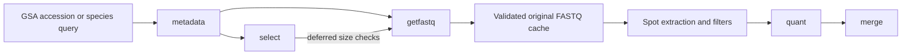

## Public GSA inputs

AMALGKIT can retrieve public short-read FASTQ data from CNCB's Genome Sequence
Archive (GSA) directly through `metadata` and `getfastq`. There is no local
FASTQ prerequisite and no `integrate` step. NCBI remains the default metadata
source.



## Accession and species discovery

Use a CRA archive, CRX experiment, CRR run, or PRJCA project accession:

```bash
amalgkit metadata --source gsa --accession CRR2759991 --out_dir ./gsa-work
amalgkit getfastq --out_dir ./gsa-work
```

This real accession is an example of paired mouse RNA-seq, not a small test
download. Choose an accession appropriate to your analysis and storage budget.

For a species list with a `scientific_name` column:

```bash
amalgkit metadata --source gsa --species_tsv species.tsv --mode base --out_dir ./gsa-work
```

Species mode searches for the species and RNA-Seq, then checks the returned
scientific name and library strategy. `title_union`, `title_split`, and
`--organ_terms_tsv` retain the usual per-species output layout; title terms are
matched against experiment titles, case-insensitively, after retrieval. Tissue
and sample-group annotations come from BioSample attributes, not inferred from
an accession or a filename.

Free-text searches use BIG Search syntax, not Entrez field tags:

```bash
amalgkit metadata --source gsa --search_string '"Arabidopsis thaliana" AND "RNA-Seq"' --out_dir ./gsa-search
```

`--accession`, `--search_string`, and `--species_tsv` are mutually exclusive.
`--resolve_names` continues to use NCBI taxonomy, independently of the read
archive. Set `--resolve_names no` when taxonomy name resolution is unnecessary.

`getfastq --id CRR2759991` also resolves GSA metadata automatically. `--id_list`
accepts both GSA and INSDC accessions, one per line. Entrez-specific additional
search terms cannot be applied to GSA IDs. The existing `--layout` and
`--sci_name` filters still apply to accession-driven getfastq retrieval.

## Metadata contract

`metadata/metadata.tsv` retains standard scientific name, sample, experiment,
project, library and tissue columns. GSA adds:

| Column | Meaning |
| --- | --- |
| `data_source` | `gsa` |
| `data_format` | `fastq` |
| `gsa_metadata_url` | public Run page used for the record |
| `gsa_retrieved_at` | UTC retrieval time |
| `gsa_input_fingerprint` | digest of the validated original file contents, recorded after download |
| `gsa_fastq_files` | portable JSON file manifest: filename, download sources, mate and ordered file group; checksum/byte count when available |
| `read_count_status` | `unknown` before measurement, `measured` after full input validation |
| `gsa_deferred_select` | size-dependent selection rules still awaiting measured counts |
| `gsa_selection_status` | `pending_input_counts` or `resolved` when selection was deferred |

Keep these columns when copying or editing metadata. CRR accessions remain the
Run IDs and `private_file` is `no`. Download URLs are read from GSA; shard names
such as `gsa2` or `gsa6` are never constructed from an accession. Rounded file
sizes displayed in MB are not treated as exact byte counts.
Selection preserves the JSON columns verbatim while cleaning free-text
annotations. `data_source` is normalized for case and surrounding whitespace
when metadata is loaded.

## Unknown read counts and selection

GSA may omit read and base counts. AMALGKIT leaves them missing in metadata
rather than inventing large values. `getfastq` downloads and validates the full
inputs, counts spots and bases, and only then allocates its extraction budget.
For paired libraries, a spot is one pair and its bases include both mates.

When `select` needs an unknown GSA spot count for `min_nspots` or numeric
BioSample deduplication, the decision is recorded as pending. Other selection
rules still run. After measuring inputs, getfastq applies the pending threshold
and deduplicates the selected candidates using their real counts. Samples
removed at this point are not automatically replaced by other candidates;
rerun selection on the measured table if replacement sampling is needed.
Each new selection rebuilds its deferred checks from the current rules, so
changed thresholds and removed rules do not retain earlier pending decisions.

Measured annotations and selection decisions are written to
`getfastq/metadata.tsv`, with a source/contents fingerprint in
`getfastq/gsa_metadata_state.json`. The original query/selection table remains
unchanged. Concurrent array jobs merge measurements under a lock. Original
`is_sampled` values and table order stay stable for `--batch`; newly failed
rules update `exclusion`. A deferred BioSample comparison is finalized when all
selected members of that group have measured counts. Finish all getfastq array
jobs before starting quantification.

The original table is captured before batching or downloading, and its contents
are checked again before publishing measurements. Editing that table or the
accession list during getfastq stops publication; rerun with the updated input.
Accession-driven array jobs retain the full resolved Run collection in the
snapshot, merging measurements regardless of job completion order. Only jobs
with the same input collection and definitions share measurements. GSA Run
discovery uses stable accession ordering for reproducible batch assignments.

With inferred metadata, `quant` and `merge` automatically use this measured
snapshot only while its fingerprint matches the original metadata table.
Explicit metadata paths remain explicit. For an accession-driven getfastq run,
or when you originally supplied a different metadata file, pass the snapshot:

```bash
amalgkit quant --out_dir ./gsa-work --metadata ./gsa-work/getfastq/metadata.tsv --fasta_dir ./fasta --build_index yes
amalgkit merge --out_dir ./gsa-work --metadata ./gsa-work/getfastq/metadata.tsv
```

Both explicit and inferred downstream inputs reject eligible runs whose
selection is still pending. An explicit path does not bypass this check.
When getfastq itself reads `getfastq/metadata.tsv`, it keeps an immutable input
copy in `getfastq/gsa_input_metadata/` so array jobs can update measurements
without changing their shared input generation. Retain these copies until
all related jobs finish. User edits to the input are still detected.

A run that fails its measured count threshold has no processed FASTQ output.
If no eligible runs remain, getfastq reports that condition; review the measured
table rather than treating those runs as download failures.

## Download, extraction, and resume

GSA originals are cached below
`<download_dir>/gsa/<CRR>/<manifest-fingerprint>/`. Downloads use partial files,
provider checksums when available, full compression/FASTQ validation, and paired
read-count and ID/order checks. Each corrupt file is retried once; an ambiguous
mate assignment, missing mate, unsupported format, or persistent failure stops
the run. Multiple file groups are processed in stable order with matching mates.
Gzip, bzip2, and uncompressed FASTQ inputs are supported; processed output uses
the usual `.amalgkit.fastq.gz` names.
HTTP transfers also verify declared Content-Length and Content-Range against
received bytes; a structurally valid partial FASTQ is not sufficient to declare
an incomplete HTTP transfer successful.
Interrupted curl transfers automatically resume from the retained offset for up
to three retries, with 1/2/4-second backoff within the original transfer deadline.
Only transient transport errors and HTTP 408/429/500/502/503/504 are retried;
invalid range responses and permanent failures stop. When retries are exhausted,
a partial FASTQ remains available for the next invocation instead of falling
back to a full urllib download. Diagnostics include the curl exit code, HTTP
status, and a bounded error message with URL credentials removed; urllib failures
include the exception type and reason.

`gsa_input_seconds` records the current invocation's input preparation time
(download or cache lookup plus validation). It appears in the measured metadata,
per-run statistics, and getfastq's final report. GSA-only reports omit inapplicable
SRA/fasterq-dump timings. The startup tool inventory honors explicit executable
paths such as `--seqkit_exe` and `--fastp_exe`.
Explicit mate markers such as R1/R2 take precedence over sample numbers in
filenames; conflicting explicit markers are rejected. A missing newline on a
source's final quality line is normalized before combining file groups.

The full original input must be downloaded even when `--max_bp` is small.
`--max_bp` retains its usual role as an extraction target, not a download-size
limit. Minimum read length is applied before the optional filters; both mates
are discarded together when either is too short. Additional extraction uses
non-overlapping spot ranges from the same validated originals. Resume checks
include the GSA file manifest and validated content digest so changing the source invalidates stale processed
output.
Extraction also checks that the currently validated cache has the same content
digest as the measured input. Merge rejects statistics with a different digest
or contradictory measured counts. Original input counts include both mates even
when identical paired reads are subsequently treated as single-end output.

Original GSA caches remain available after `--remove_sra yes` and after quant;
that option removes SRA objects, not GSA originals. Plan disk space for full
inputs plus processed outputs, and retain the cache while retries or additional
extraction may be needed.

| Option | Default | Purpose |
| --- | --- | --- |
| `--gsa_metadata_timeout_seconds` | `30` | per-request timeout; transient failures get three attempts |
| `--gsa_metadata_max_concurrency` | `1` | cross-process metadata request limit |
| `--gsa_download_max_concurrency` | `2` | cross-process original-file download limit |

Share `--download_lock_dir` across jobs to share the concurrency limits. GSA-only
getfastq runs do not require SRA Toolkit. SeqKit and enabled filtering tools
remain dependencies. Mixed GSA/SRA runs retain SRA Toolkit requirements.

## Provider boundary and limitations

Discovery uses the JSON service backing [BIG Search](https://ngdc.cncb.ac.cn/search/).
CRR resolution and file/sample details use public GSA/BioSample pages, such as
[this Run page](https://ngdc.cncb.ac.cn/gsa/browse/CRA039433/CRR2759991).
Those provider-specific parsers are isolated and validate required identities,
relationships, pagination and file mappings. An outage or changed page is an
error, not an empty successful query. This integration does not assume a
versioned public API guarantee.

The initial native scope is public short-read FASTQ. GSA-Human controlled-access
records, BAM, and PacBio/ONT long-read inputs are not supported by this path.
GSA and INSDC accessions are not assumed to identify different biological data;
no cross-archive deduplication is performed without explicit shared identifiers.
Known unsupported file types, layouts and long-read platforms remain visible in
metadata with an `unsupported_gsa_*` exclusion reason; a missing download link
for an otherwise supported public FASTQ remains an error.
