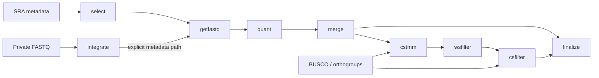

[](https://github.com/kfuku52/amalgkit/actions/workflows/tests.yml)
[](https://github.com/kfuku52/amalgkit/releases)
[](https://anaconda.org/bioconda/amalgkit)
[](https://github.com/kfuku52/amalgkit)
[](https://anaconda.org/bioconda/amalgkit)
[](https://anaconda.org/bioconda/amalgkit)
[](https://opensource.org/licenses/MIT)

## Overview

**AMALGKIT** (/əm`ælgkit/) integrates public SRA and private FASTQ data for
cross-species gene-expression analysis. It supports sample selection,
quantification, normalization, and filtering to help reduce technical bias;
the resulting comparisons still depend on the input data and biological design.



CSTMM and the filters are optional; filters may be used in either order.

## Installation

AMALGKIT requires Python 3.11 or later on Linux or macOS; CI covers Python 3.11–3.14.

```bash
# Latest default-branch version (includes patch updates)
pip install --upgrade git+https://github.com/kfuku52/amalgkit

# Or the packaged Bioconda version
mamba install -c conda-forge -c bioconda --strict-channel-priority amalgkit

amalgkit --version
amalgkit help metadata
```

`getfastq` requires `fasterq-dump` from `sra-tools >= 3` and SeqKit even for
private-only runs, plus fastp unless `--fastp no` is used. `quant` requires
kallisto for short reads or Oarfish for long reads, including automatic backend
selection. See [installation and dependencies](https://github.com/kfuku52/amalgkit/wiki/Installation-and-dependencies).

Patch updates are available from the default branch and listed in
[CHANGELOG.md](CHANGELOG.md). Tags, GitHub Releases, and Bioconda recipe updates
are created only when the patch component is zero (for example, `0.17.0`).
Record both the version and source revision for reproducible analyses.

## Getting started

The [yeast tutorial](https://github.com/kfuku52/amalgkit/wiki/Tutorial-1) walks
through metadata review, selection, quantification, and cross-species filtering.
Its bundled FASTAs are small BUSCO-focused examples, not full transcriptomes.

```bash
amalgkit dataset --name yeast --out_dir ./demo
```

For your own data, start an empty workspace and follow its generated guide:

```bash
amalgkit dataset --name init --out_dir ./work
```

Review the rules before selection: the base, test, plantae, and vertebrate
presets currently select `flower,leaf,root`. Other groups, such as liver,
require edits to both the group parameter and relevant rules. See
[selection](https://github.com/kfuku52/amalgkit/wiki/amalgkit-select).

Before quantification, supply one reference transcriptome per species under
`fasta/` and use `--build_index yes`, or prepare matching backend indices under
`index/`. These references/indices are not downloaded by `quant`.

```bash
# After preparing references and selected metadata in work/
amalgkit getfastq --out_dir ./work
amalgkit quant --out_dir ./work --build_index yes
amalgkit merge --out_dir ./work
amalgkit finalize --out_dir ./work --input_dir ./work/merge --metadata ./work/merge/metadata.tsv --batch_effect_alg no
```

For [private FASTQ](https://github.com/kfuku52/amalgkit/wiki/amalgkit-integrate),
pass the generated `integrate` metadata explicitly through `getfastq`, `quant`,
and `merge`. For CSTMM or long-read outputs, follow
[metadata and normalization](https://github.com/kfuku52/amalgkit/wiki/Metadata-and-normalization):
CSTMM FPKM needs the original library-size metadata, and Oarfish requires a
compatible `--norm`, such as `log2p1-none`.

## Command guides

| Stage | Commands |
| --- | --- |
| Prepare inputs | [dataset](https://github.com/kfuku52/amalgkit/wiki/amalgkit-dataset), [metadata](https://github.com/kfuku52/amalgkit/wiki/amalgkit-metadata), [integrate](https://github.com/kfuku52/amalgkit/wiki/amalgkit-integrate), [select](https://github.com/kfuku52/amalgkit/wiki/amalgkit-select) |
| Quantify | [getfastq](https://github.com/kfuku52/amalgkit/wiki/amalgkit-getfastq), [quant](https://github.com/kfuku52/amalgkit/wiki/amalgkit-quant), [merge](https://github.com/kfuku52/amalgkit/wiki/amalgkit-merge) |
| Normalize and filter | [busco](https://github.com/kfuku52/amalgkit/wiki/amalgkit-busco), [cstmm](https://github.com/kfuku52/amalgkit/wiki/amalgkit-cstmm), [wsfilter](https://github.com/kfuku52/amalgkit/wiki/amalgkit-wsfilter), [csfilter](https://github.com/kfuku52/amalgkit/wiki/amalgkit-csfilter), [finalize](https://github.com/kfuku52/amalgkit/wiki/amalgkit-finalize) |
| Check and recover | [sanity](https://github.com/kfuku52/amalgkit/wiki/amalgkit-sanity), [rerun](https://github.com/kfuku52/amalgkit/wiki/amalgkit-rerun) |

See [parallel processing](https://github.com/kfuku52/amalgkit/wiki/Parallel-processing)
for CPU budgets and command-specific batch units. Developer setup and structured
logging are covered in [architecture and development](https://github.com/kfuku52/amalgkit/wiki/Architecture-and-development).
The [Wiki home](https://github.com/kfuku52/amalgkit/wiki) also maps legacy
`config`, `curate`, and `csca` commands to their replacements.

## Citation
Although **AMALGKIT** supports novel unpublished functions, some functionalities including metadata curation, expression level quantification, and further curation steps have been described in this paper, in which we reported the transcriptome amalgamation of 21 vertebrate species.

Fukushima K*, Pollock DD*. 2020. Amalgamated cross-species transcriptomes reveal organ-specific propensity in gene expression evolution. Nature Communications 11: 4459 (DOI: 10.1038/s41467-020-18090-8) [open access](https://www.nature.com/articles/s41467-020-18090-8)

## Licensing
**amalgkit** is MIT-licensed. See [LICENSE](LICENSE) for details.
